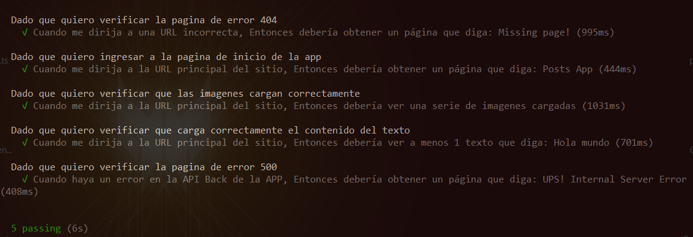
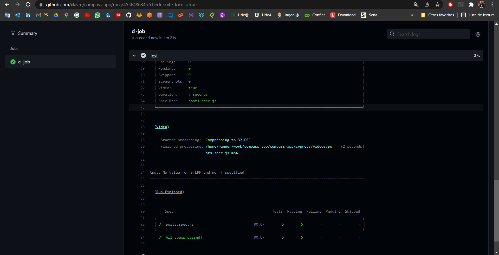

# Challenge Frontend

## Resolución de Tests 

### **Test Final con Cypress**
* Casos de Pruebas: **5**
* Casos de pruebas Correctos: **5/5** 

Casos de Pruebas: 

--------------------------------------------------------------

## Implementación - Test

Realizo un `Exploritory Testing` manual para tener más detalle de la APP.

Aplico algunos principios `SOLID` al usar el patron de diseño `Page Objects` para desarrollar unos scripts escalables y de fácil mantenimiento; (teniendo en cuenta que el desarrollo estaba hecho), aplico `BDD` para realizar los test unitarios y de integración con base a principios de `Clean Code` y aplicando las `Best Practices` recomendadas por el framework utilizado `Cypress`.

Aseguro un `100%` los casos de pruebas, cubriendo así mismo los casos en que la api funciona de forma correcta y de forma incorrecta.

--------------------------------------------------------------

## CI - Test

Creo un archivo `ci.yml` dentro de la ruta: `.github/workflows` que contiene las instrucciones necesarias para llevar a cabo la ejecución de un pipeline de CI que se encarga de ejecutar los `Test` sí se hace un `push` o un `Pull Request` a la rama `Main` (Esto es orquestado por `Github Actions` de forma automatizada).

**Resultado de Ejecución**

--------------------------------------------------------------

## Ejecución Local - Test

> Ejecuta los comandos: `npm install`, `npm start` y luego `npm run cypress`

--------------------------------------------------------------

## Requerimientos

Armar una web donde se vean los post de la misma manera que en la imagen adjunta y lleven a la web del post, que lo único que tiene que hacer es mostrar el post con el mismo componente que se usa en la web anterior, sin nada mas.

## Propuesta

En la propuesta se detallan las carateristicas de la pagina:

- Diseño responsivo (mobile first)
- Controlar los errores 404 y 500
- Se agregó una lógica para que el backend falle (seudo) aleatoriamente
- Documentacion en este readme
- Repositorio en Github
- Deploy en Heroku

A continuacion se muestra un grafico que diseñe para bajar los requerimientos "a papel":

> Las cosas que figuran como "opcionales" son ideas para completar la experiencia original.

## Capturas de pantalla

Se adjuntan capturas para:

- Caso feliz en mobile
- Caso feliz en desktop
- Pantalla de error 404
- Pantalla de error 500

> Todas las capturas corresponden al unico endpoint definido: GET /posts

MOBILE - Caso feliz

DESKTOP - Caso feliz

DESKTOP - Pantalla de "not found"

DESKTOP - Pantalla de "internal server error"

 

## Scripts

Los scripts disponibles son:

- `yarn start`: levantar la app localmente
- `yarn test`: correr los tests
- `yarn build`: genera los archivos estaticos y los minifica, entre otras cosas.
- `yarn eject`: para ver la magia oculta en este boilerplate.

## Tests

Por cuestiones de tiempo, no pude realizar los test que queria hacer, ya que no estoy familiarizado con la lib `testing-library@react`.
Me hubiera justado hacer al menos tests de integracion para:

- el caso feliz
- un error de la api
- una direccion que no ruteamos
  Me hubiera gustado tambien hacer tests unitarios de snapshots para cada componente definido.

## Mejoras a futuro

### Velocidad de carga

Actualmente la app tarda en cargar las imágenes, en especial la primera vez. \
 Esto se puede mejorar, por ejemplo: usando thumbnails, usando imagenes de distintas resoluciones, con skeletons, entre otras cosas.

### Aspect Ratio

La API que elegi para obtener las imagenes carece de un estandar de ratio: cada imagen tiene un tamaño distinto de la anterior. \
 Mi decision de mostrar las imagenes con alto y ancho fijo, hizo que algunas imagenes se vean "mal".
Se puede mejorar definiendo un estandar para carga de imagenes.
